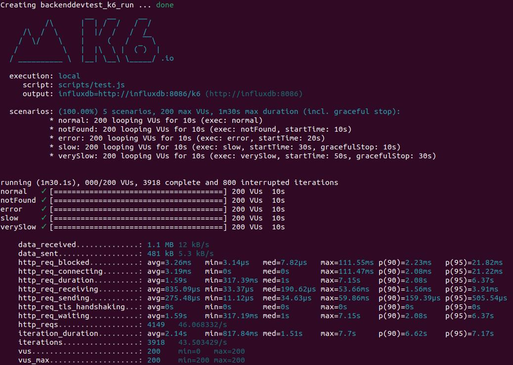

# Backend dev technical test
Create a new REST API operation that will provide them the product detail of the similar products for a given one

## Import the project into Intellij

If you want to import these project into the local eclipse setup -

  1. Download the project as zip file into your computer
  2. Unzip the project at your desired location
  3. Open the project into intellij
  4. Execute the app: "Run McsvNewapiApplication"

## Test API in Postman

### GET  
    curl --location 'localhost:5000/product/1/similar'

## Testing and Self-evaluation

  Raise the infrastructure with the following command

    docker-compose up -d simulado influxdb grafana

  Check that mocks are working with a sample request to:  http://localhost:3001/product/1/similarids

### Change value
  * Find file test.js in de folder backendDevTest/shared/k6
  * Change host = "http://host.docker.internal:5000" for localhost or your IP local.
  
### To execute the test run:

    docker-compose run --rm k6 run scripts/test.js

View the results in to Browser:  http://localhost:3000/d/Le2Ku9NMk/k6-performance-test

# Result test

